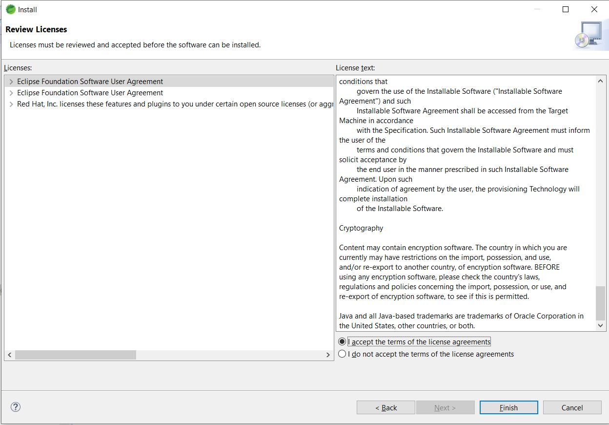
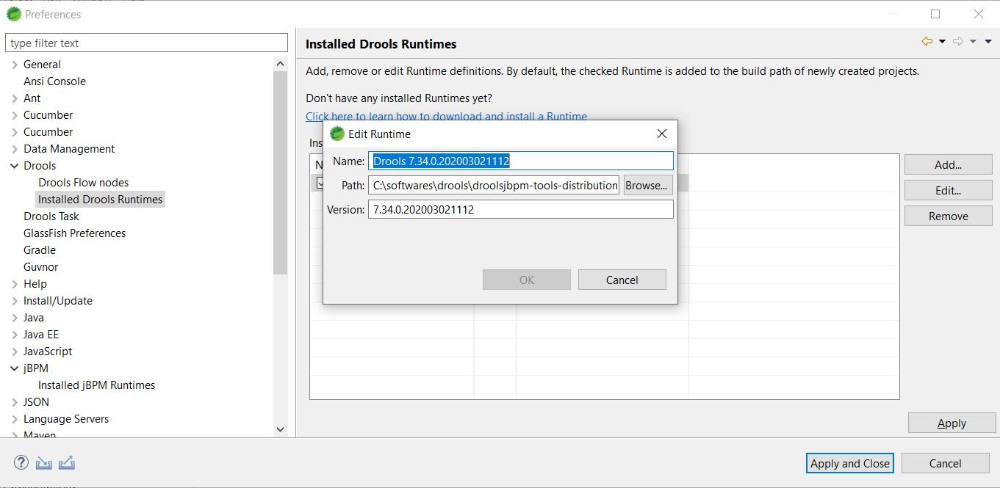
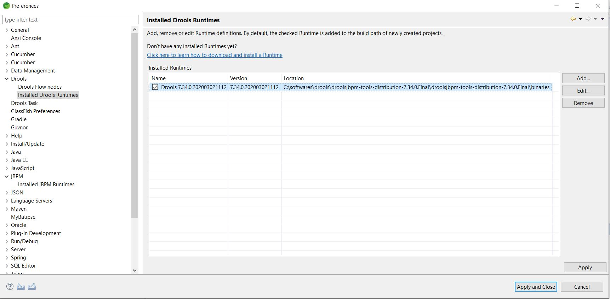

## Drools Plugin Installation in Eclipse
* Download drools binaries from [https://download.jboss.org/drools/release/5.3.0.Final/](https://download.jboss.org/drools/release/5.3.0.Final/)
	* Download `droolsjbpm-tools-distribution-5.3.0.Final.zip` file
* Extract zip
* Install in Eclipse
	* Open Eclipse - Help - Install New Software...
	* Click 'Add' button
	* Click 'Local' button
	* Select `droolsjbpm-tools-distribution-5.3.0.Final\binaries\org.drools.updatesite`. Select `Drools and jBPM` and Click `Next` button

	* Click `Next` button
	
	* Accept `license agreement`
	
	* Click `Finish` button
	* Click `Install anyway` button

	* Click `Restart Now` button

	* After restart - go to - `Window/Preferences/Drools/Installed Drools Runtimes`

	* Click `Add` button

	* Click `Create a new Drools 5 Runtime` and select until `droolsjbpm-tools-distribution-5.3.0.Final\binaries`. Click `Ok` button

	* Select `Drools 5.3.0 Final runtime`
	