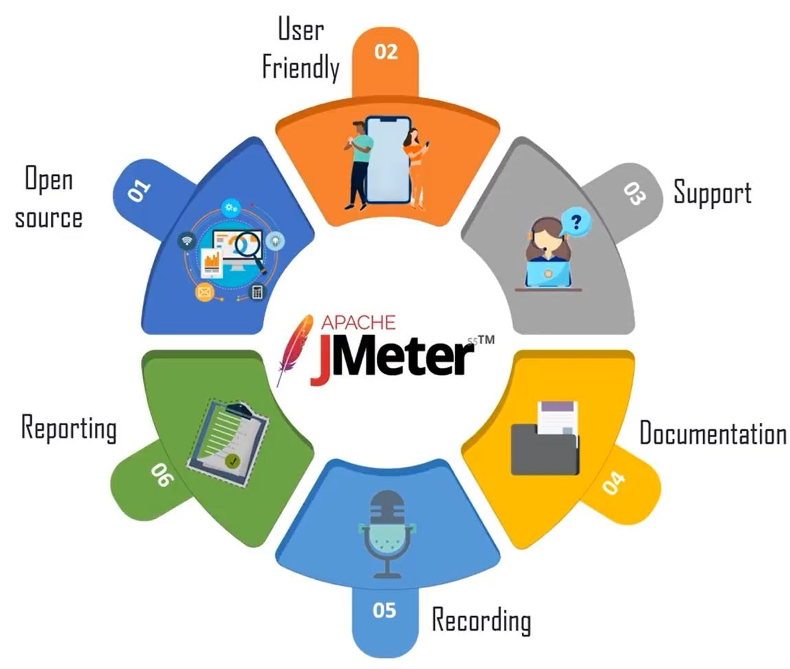

# Apache JMeter Notes

## What is jmeter
* Open source software used for load testing for analysis and measuring performance of variety of services

## Why we need jmeter
* To verify product performance

## What is performance testing
* Type of software testing to ensure software perform well under their expected work load
* Performance testing check whether application under test satisfies required benchmark for
	* Load testing - check whether application can handle required number of concurrent user accesses without any failure
	* Stress testing - how application performing with high load with limited resources

## Advantages of jmeter

## Installation of jmeter

## Elements of jmeter

## JMeter for load testing and performance testing